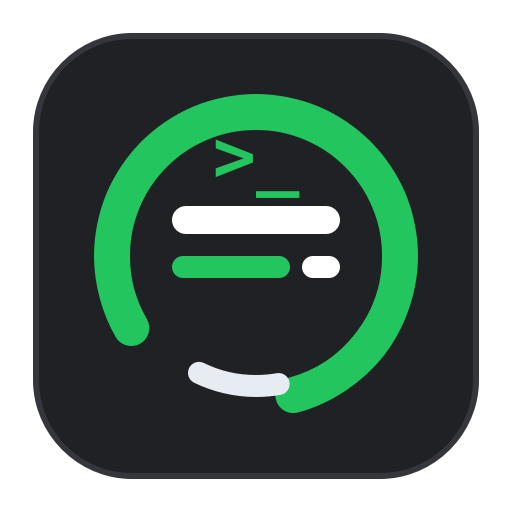
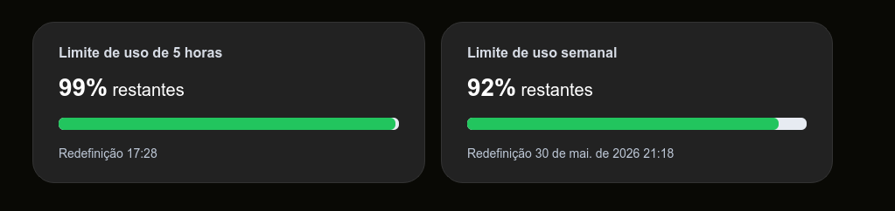

<p align="center">
  
</p>

# Codex Widget

Codex Widget is a small floating desktop widget for monitoring your current Codex usage limits. It shows the two limits exposed by the ChatGPT/Codex account usage endpoint:

- **5-hour usage window**
- **Weekly usage window**

The widget stays on top of the desktop, can be dragged anywhere, and supports compact horizontal or vertical layouts.

<p align="center">
  
</p>

> [!IMPORTANT]
> Codex Widget reads your local Codex authentication file and uses an internal ChatGPT endpoint. Treat `~/.codex/auth.json` as a secret. Do not commit it, log it, or share it.

## Features

- Floating always-on-top PyQt6 widget
- 5-hour and weekly remaining usage cards
- Progress bars matching the remaining percentage
- Reset time display for both windows
- Horizontal and vertical layouts
- Keyboard resizing for compact desktop placement
- Uses the existing Codex login from `~/.codex/auth.json`

## How Authentication Works

Codex Widget does not ask you to log in separately. It reads the same local authentication file used by Codex:

```text
~/.codex/auth.json
```

From that file it extracts:

- `tokens.access_token` or `tokens.accessToken`
- `tokens.account_id`, `tokens.accountId`, or the `chatgpt_account_id` claim inside `tokens.id_token`

It then calls:

```http
GET https://chatgpt.com/backend-api/wham/usage
Authorization: Bearer <access_token>
chatgpt-account-id: <account_id>
Accept: application/json
```

The response contains `rate_limit.primary_window` and `rate_limit.secondary_window`. Codex Widget maps:

- `limit_window_seconds = 18000` to the **5-hour** card
- `limit_window_seconds = 604800` to the **weekly** card

> [!NOTE]
> `/backend-api/wham/usage` is not a public OpenAI Platform API. It is the same internal account usage endpoint used by Codex-related clients and may change without notice.

## Requirements

- Linux desktop environment
- Python 3.10+
- A working Codex login at `~/.codex/auth.json`
- PyQt6

## Installation

Create and activate a virtual environment:

```bash
cd /home/fabio/projetos/codex-widget
python3 -m venv .venv
source .venv/bin/activate
```

Install the project:

```bash
pip install -r requirements.txt
pip install -e .
```

After installation, the package provides this command:

```bash
codex-widget
```

You can also run the local launcher directly:

```bash
python3 scripts/codex_usage_widget.py
```

## Usage

Start the widget:

```bash
codex-widget
```

Optional arguments:

```bash
codex-widget --auth-file ~/.codex/auth.json
codex-widget --refresh-seconds 30
codex-widget --base-url https://chatgpt.com/backend-api
```

The widget refreshes usage automatically. The default refresh interval is 60 seconds.

## Keyboard Shortcuts

| Shortcut | Action |
| --- | --- |
| `Ctrl++` | Increase widget size |
| `Ctrl+=` | Increase widget size on keyboards where `+` is typed with `=` |
| `Ctrl+-` | Decrease widget size |
| `Ctrl+H` | Toggle horizontal/vertical layout |
| `Q` | Quit |

The widget can also be dragged with the left mouse button.

## Creating a Desktop Shortcut

This repository includes `codex-widget.desktop` as a base desktop entry:

```ini
[Desktop Entry]
Type=Application
Name=Codex Widget
Comment=Floating desktop widget for Codex usage limits
Exec=/home/fabio/projetos/codex-widget/.venv/bin/codex-widget %u
Terminal=false
Icon=/home/fabio/projetos/codex-widget/assets/codex_logo.png
Categories=Utility;
```

To install it for your user:

```bash
mkdir -p ~/.local/share/applications
cp /home/fabio/projetos/codex-widget/codex-widget.desktop ~/.local/share/applications/
update-desktop-database ~/.local/share/applications 2>/dev/null || true
```

Make sure the `Exec` path points to the installed command inside your virtual environment:

```text
/home/fabio/projetos/codex-widget/.venv/bin/codex-widget
```

Make sure the `Icon` path points to:

```text
/home/fabio/projetos/codex-widget/assets/codex_logo.png
```

If you installed the project somewhere else, edit both paths before copying the desktop file.

## Project Structure

```text
assets/codex_logo.png          Project icon
codex-widget.desktop           Desktop launcher template
requirements.txt               Runtime dependencies
scripts/codex_usage_widget.py  Local development launcher
src/codex_widget/main.py       Application entry point
src/codex_widget/usage.py      Codex auth and usage fetcher
src/codex_widget/view_model.py Usage formatting for the UI
src/codex_widget/widget.py     PyQt6 floating widget
```

## Security Notes

- The widget never prints your access token.
- The widget reads `~/.codex/auth.json` locally.
- The access token is only sent to `https://chatgpt.com/backend-api/wham/usage`.
- If usage fetching fails, the widget shows an error message instead of exposing token data.

If you suspect your local Codex credentials were exposed, rotate/revoke the credential or log out and log back in with Codex.
